# Hello !

I am Valentin a Full-Stack developer studying at <a href="https://github.com/Epitech">Epitech Paris</a> !

  <h3>My Stats</h3>

  
  

  <h3>Langages</h3>

  
  <h3>Libraries</h3>

  
  <h3>Databases</h3>

  
  <h3>Tools</h3>

  

  <h3>Contact me</h3>
  

    <a href="https://linkedin.com/in/valentin-dunon">LinkedIn</a>
    -
    <a href="mailto:vdunon91gmail.com">vdunon91@gmail.com</a>
  

